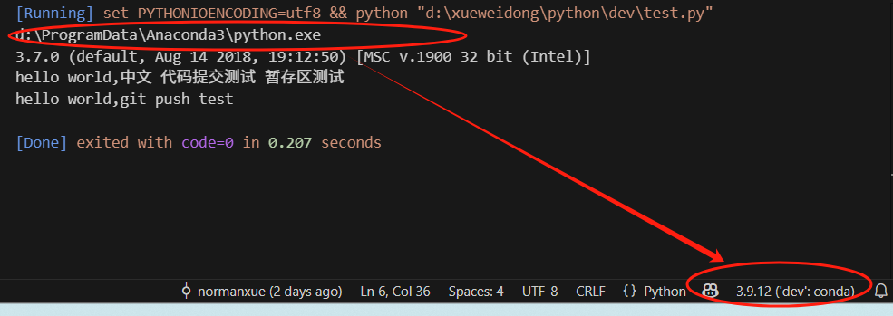

# 一 环境问题
## 1 vscode output输出乱码
###  现象

###  解决方案
https://blog.csdn.net/williamcsj/article/details/121940871
// 配置python语言正常输出中文的环境
"code-runner.executorMap":{ 
    "python":"set PYTHONIOENCODING=utf8 && python"
}, 

## 2 vscode 修改python解释器
###  现象

配置为anaconda的python解释器，但代码输出仍为base环境
###  解决方案
临时：https://blog.csdn.net/m0_48273685/article/details/127616066，此方案有效，但太麻烦
有效方案：在系统环境变量path中，增加dev环境python解释器路径

# 二 代码问题
## 1 待补充 